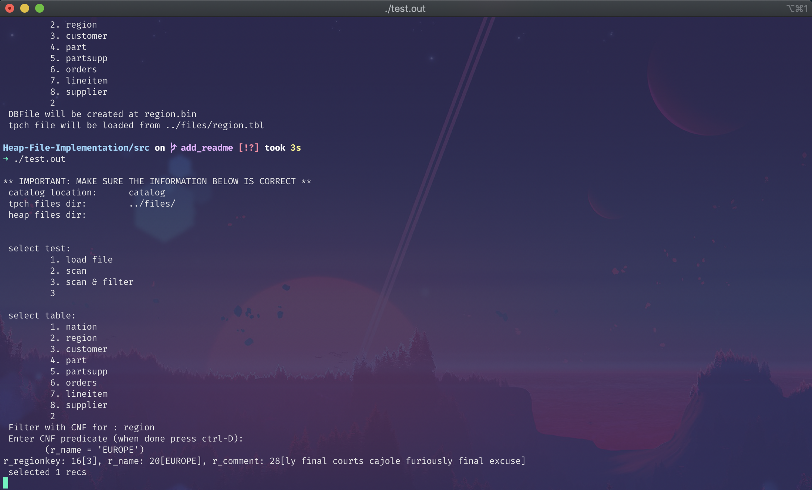
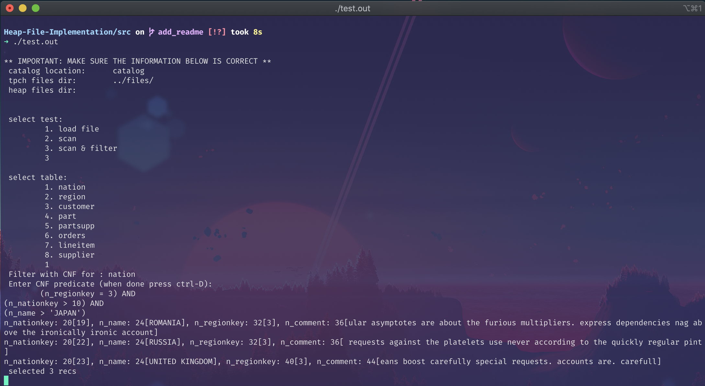
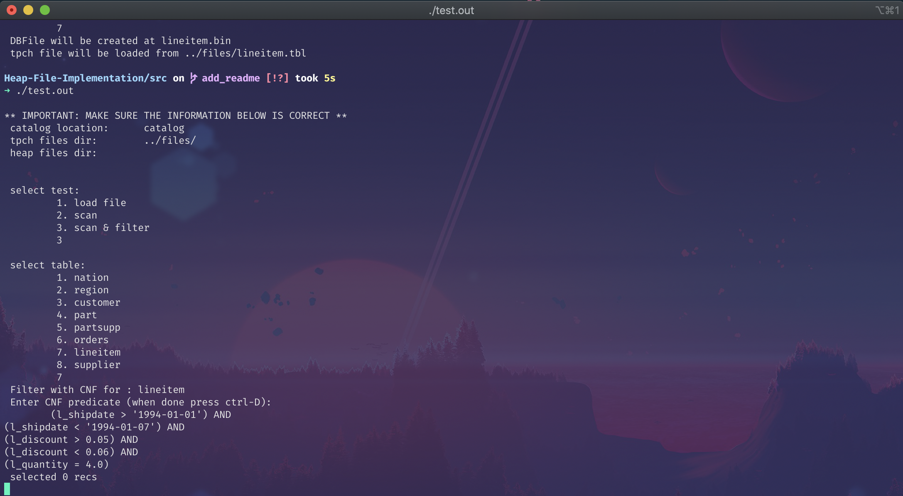
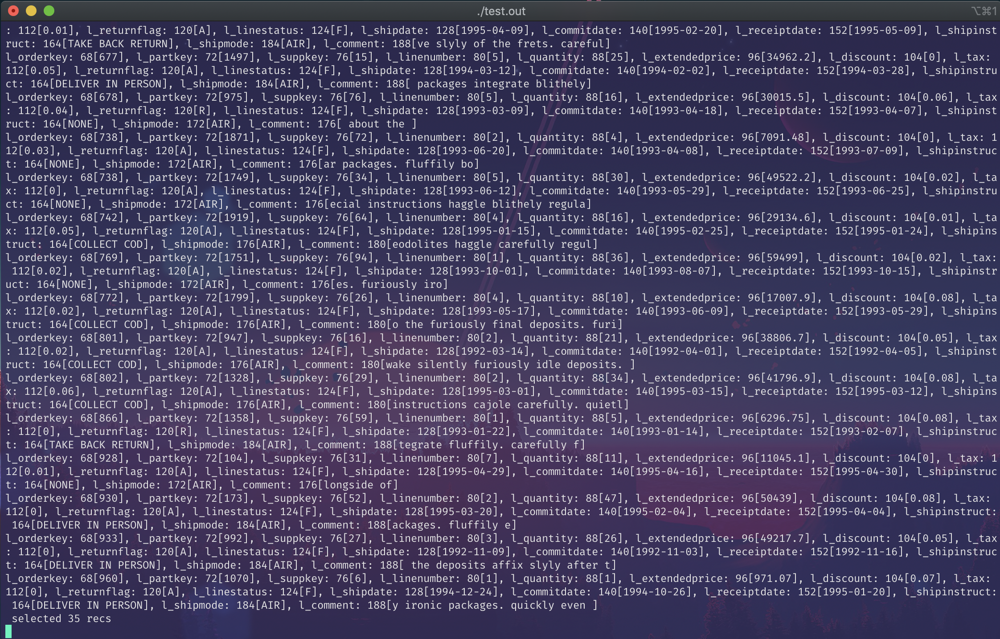
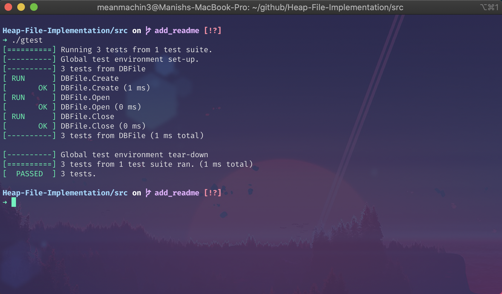

<h1 align="center"> Project Report </h1>  

## Table of Contents

- [Table of Contents](#table-of-contents)
- [Build Process](#build-process)
- [DBFile.cc](#dbfilecc)
  - [DBFile::Create](#dbfilecreate)
  - [DBFile::Open](#dbfileopen)
  - [DBFile::Close](#dbfileclose)
  - [DBFile::Load](#dbfileload)
  - [DBFile::Add](#dbfileadd)
  - [DBFile::WriteToFile](#dbfilewritetofile)
  - [DBFile::MoveFirst](#dbfilemovefirst)
  - [DBFile::GetNext(Record)](#dbfilegetnextrecord)
  - [DBFile::GetNext(Record &record_to_fetch, CNF &cnf, Record &literal)](#dbfilegetnextrecord-recordtofetch-cnf-cnf-record-literal)
- [Test Results](#test-results)
  - [test.cc](#testcc)
    - [q1](#q1)
    - [q2](#q2)
    - [q3](#q3)
    - [q11](#q11)
    - [q12](#q12)
  - [Gtest](#gtest)

## Build Process

- unzip the compressed file using `unzip filename.zip`
- `cd src` to change to source directory
- `make test.out` to compile test.out
- `./test.out` to run the compiled binary
- `make gtest` to compile google test cases
- `./gtest` to run test cases
- `make clean` to clean the compiled binaries

## DBFile.cc

Following are the states used in this program

- `file`: It's an instance of class `File` implementing heap
- `read_page`: It's an instance of class `Page` that is used to read records
- `write_page`: It's an instance of class `Page` that is used to write records
- `head`: It's an instance of class `Record` pointing to the current record
- `read_index`: Maintains a count of number of records it has read
- `write_index`: Maintains a count of number of records it has written
- `comparisonEngine`: It's an instance of class `ComparisonEngine` used to filter records using a CNF
- `has_record_to_write`: It's a boolean that would be set to true if there's any record in Page buffer that is yet to be written to the file; false otherwise.
- `is_end_of_file`: It's a boolean that denotes that we have reached at the end of a file.

### DBFile::Create

In order to create a file, we make use of exiting `File::Open()` method with argument `0`(Since we want to create a file). Once a file is created we initialize other parameters such as `read_index`, `write_index`, `has_record_to_write` & `is_end_of_file` to their default values.

### DBFile::Open

To open a file, `File::Open()` is used with argument `1`(Since we want to open a file) & f_path.

### DBFile::Close

Before closing a file, we check if there's any record left to be written. If there is we write it out to file before closing it

### DBFile::Load

In order to load, all the records from schema, we've used `SuckNextRecord` method that reads the next record from a pointer to a text file and then add it to page buffer.

### DBFile::Add

Check if the size doesn't exceed the current page size. If it exceeds then write it to file before and then add record. Else add the record to the page buffer.

### DBFile::WriteToFile

Write the current page records to file and empties the page buffer.

### DBFile::MoveFirst

Get the first page and move to the first record of that page.

### DBFile::GetNext(Record)

Gets the first record from the current read page by using `File::GetFirst()` and puts it into the record passed as an argument. This also increments the pointer into the file, so a subsequent call to `GetNext()` won't return the same record twice. In case, the record is not found in current page, we increment the `read_index` and then load the record from the corresponding page.

### DBFile::GetNext(Record &record_to_fetch, CNF &cnf, Record &literal)

This method internally calls `DBFile::GetNext(record_to_fetch)` and calls the `Compare` method of the comparison check to the satisfiability of the `cnf`

## Test Results

### test.cc

#### q1

#### q2

#### q3

#### q11

#### q12

### Gtest

